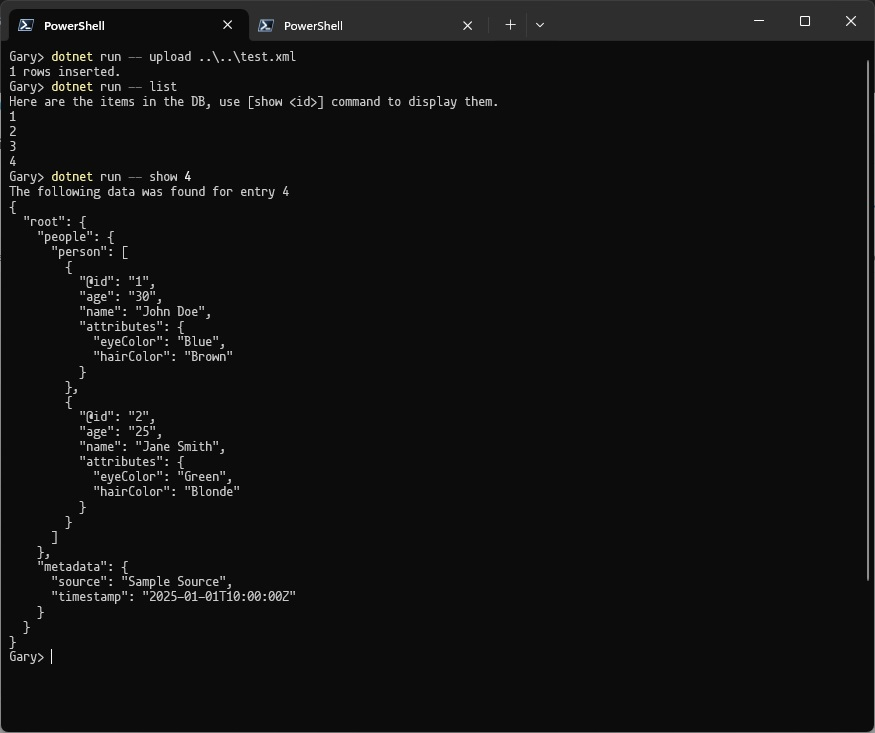

# XML-to-JSON Console App with PostgreSQL (Docker)

## Overview
This project demonstrates how to:
1. Read an XML file.
2. Convert that XML to JSON.
3. Insert the JSON into a PostgreSQL database (in a JSONB column).
4. List existing records from the database.
5. Show the JSON data for a specific record in a nicely formatted way.

## Prerequisites
- **Docker** and **Docker Compose** installed on your machine.
- **.NET SDK 9.0** (if you want to run the project locally outside of Docker).
- A text editor or IDE that supports C# (optional, but recommended).

## Project files
- **docker-compose.yml**: Orchestrates both Postgres and the console app.
- **init_db.sql**: SQL script to create the `demodata` table in the database.
- **src//jsonbdemo/Program.cs**: Main code for the console app (includes `upload`, `list`, and `show` commands).
- **jsonbdemo.csproj**: The .NET project file.
- **test.xml**: A sample XML file for demo.




## How It Works
1. **Build & Run**: Docker Compose a PostgreSQL container.
2. **Initialize DB**: The `init_db.sql` script runs inside the Postgres container to create the required table (`demodata`).
3. **Commands (from the /src/jsonbdemo folder)**:
   - `dotnet run -- upload <xml_file>`: Reads the XML from `<xml_file>`, converts it to JSON, inserts JSON into `demodata`.
   - `dotnet run -- list`: Lists IDs of all rows in `demodata`.
   - `dotnet run -- show <id>`: Displays the JSON data for the specified record ID in a pretty-printed format.

## Step-by-Step: Running the Demo

1. **Clone or Copy the Project**
   Make sure the files described above are in one folder.

1. **Run Docker Compose**

    From the project directory, run:
   ```bash
   docker-compose up
   ```
    This will:
    - Spin up the db (Postgres) container.
    - Run the init_db.sql to create the demodata table.

1. **Verify Postgres is Running** You should see logs for the Postgres container in the console and a message indicating the table was created.

    You can also log into the postgres db by running the following commands:
      ```bash
        docker exec -it "jsonb-demo" psql -U demo -d jsonbdemo
      ```
    Once logged in you can you can run queries:
      ```bash
        jsonbdemo-# select * from demodata;
      ```
      press 'q' to exit query result view.


1. **Build the Client app** Open a new terminal and cd into /src/jsonbdemo/ directory containing the dotnet project.


### Running the demo

#### Convert an XML file and store it as JSON in DB:
  ```bash
    dotnet run -- upload ./test.xml
  ```

#### List the entries:
  ```bash
    dotnet run -- list
  ```

#### Show an entry:
  ```bash
    dotnet run -- list show 1
  ```
This fetches the JSON for row id=1 and prints it (with indentation).

### Check Data in Postgres

Use
```bash
docker exec -it my-postgres psql -U myuser -d mydb
```
 to access the Postgres prompt.
Run
```sql
SELECT * FROM demodata;
```
to see your rows.

### Stop the Containers
Press Ctrl + C in the terminal where docker-compose up is running or run:
```bash
  docker-compose down
```
